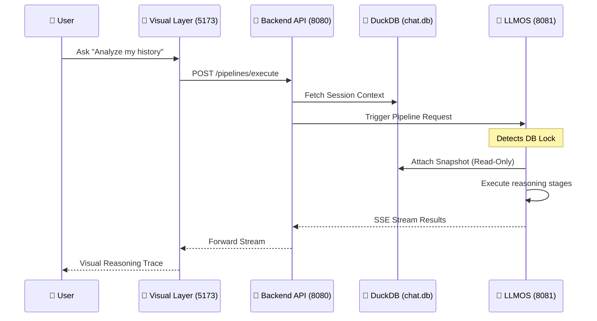

# 🏗️ Stepbit Architecture

Stepbit is a high-performance LLM orchestration platform designed with a modular, pluggable architecture. It bridges the gap between raw LLM capabilities and premium, user-centric AI applications.

---

## 🛰️ System Overview

Stepbit follows a modern client-server architecture:

- **Visual Layer (Frontend)**: A premium React 19 / Vite interface (Port 5173) that provides the Command Center, reasoning graphs, and real-time data visualizations.
- **Backend API (Rust)**: Built with `actix-web` (Port 8080), it handles orchestration, database management, and LLM provider communication.
- **Reasoning Core (Local LLMOS)**: Stepbit is designed to run alongside `stepbit-core` (Port 8081), providing a "Local-First" cognitive stack.

---

## 🧩 Core Components

### 1. API Layer (`src/api/`)
Handles the communication between the frontend and the core engine.
- **REST Endpoints**: CRUD operations for sessions, messages, skills, and pipelines.
- **WebSocket Engine**: Real-time streaming of tokens and reasoning traces with cancellation support.
- **OpenAI Proxy**: Provides a `/v1/chat/completions` endpoint for compatibility with OpenAI-compatible tools.

### 2. LLM Engine (`src/llm/`)
A pluggable provider system that abstracts the complexity of different AI backends:
- **Core (Local Reasoning)**: `stepbit-core` integration. This is the **primary, mission-critical connection** that enables the Pipelines Hub, Reasoning Graphs, and advanced MCP tools.
- **Local Fallbacks**: Ollama for standard chat tasks.
- **Cloud Providers**: OpenAI, Anthropic, GitHub Copilot.

### 3. Data Layer (`src/db/`)
Powered by **DuckDB**, a high-performance analytical database.
- **Local Memory**: Persistent storage for all conversations in `chat.db`.
- **Analytical Snapshotting**: Allows `stepbit-core` to perform non-blocking analysis on live data by attaching read-only snapshots.

### 4. Reasoning Engine & Pipelines (`src/llm/llmos.rs`)
The "Cognitive Core" of Stepbit:
- **DAG Executor**: A Directed Acyclic Graph architecture that manages node lifecycle and data flow.
- **Cognitive Pipelines**: Deterministic, multi-stage workflows (Search -> Analyze -> Synthesize).
- **Variable Resolution**: Supports `{{node_id.output}}` syntax for chaining outputs between nodes.

---

## 🔄 Data Flow

---

## 🛡️ Security Architecture

### Rolling Handshake
Internal communication between Stepbit and LLMOS is protected by a rotating token mechanism:
1. **Initial Handshake**: Stepbit uses the master `API_KEY`.
2. **Token Rotation**: LLMOS returns a new `X-Next-Token` in every response header.
3. **Chained Authentication**: The next request must use the new token, preventing replay attacks.

---

## 🎨 Visualization Layer
Stepbit interprets specific structured outputs from LLMs to render:
- **Interactive Charts**: Line, Bar, and Area charts for data trends.
- **Live SVGs**: Dynamic graphic generation.
- **Code Previews**: Live HTML/CSS rendering for UI experimentation.

---

Built with performance and aesthetics as first-class citizens.
