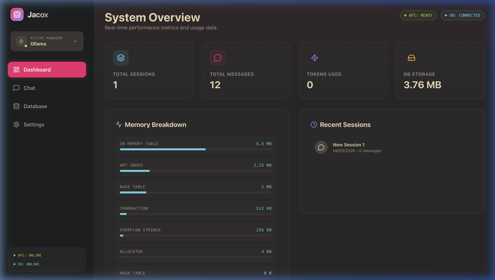
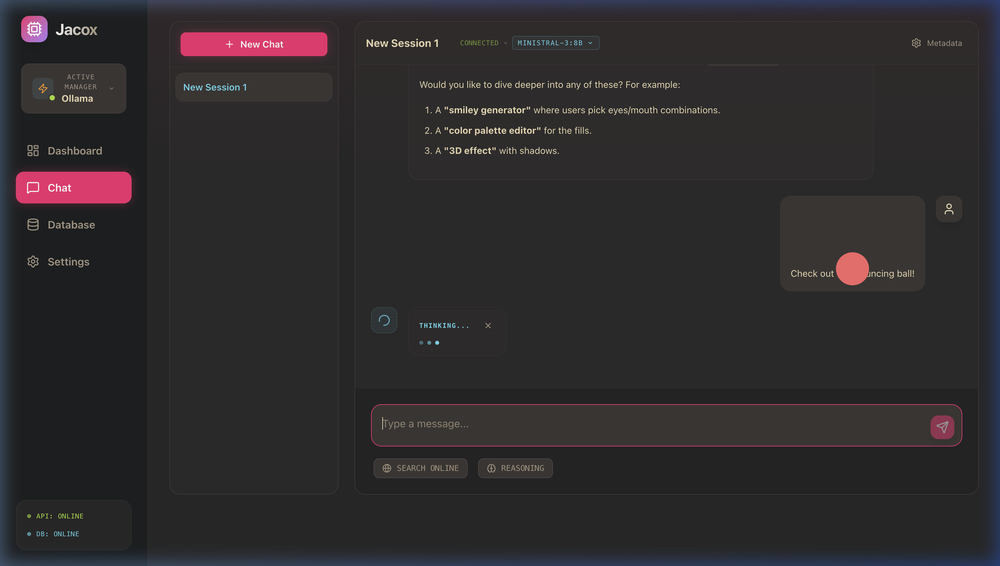
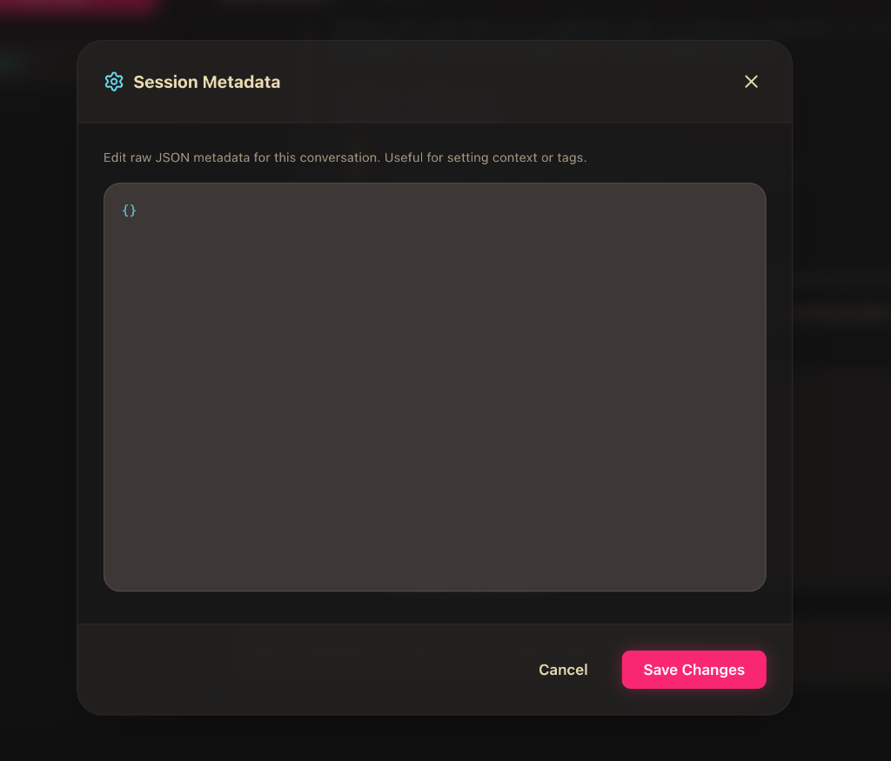

# 🌌 Jacox: The High-Performance LLM Command Center

**Jacox** is a premium, local-first LLM orchestration platform built with a **Rust** backbone and **DuckDB** intelligence. It’s designed for developers who demand speed, security, and a beautiful interface for their AI workflows.



---

## 🎨 A World-Class Aesthetic
Jacox isn't just a server; it's a sleek, dark-mode experience inspired by the **Monokai-Gruvbox** palette. 

- **Rich Markdown Rendering**: Full GFM support with optimized syntax highlighting.
- **Dynamic Graphics**: Render **Live SVGs** directly in the chat—designed for instant visualization.
- **Micro-animations**: A fluid, responsive interface that feels alive.
- **Raw/Formatted Toggles**: Deep-dive into LLM outputs with instant view switching.



## ⚡ Technical Excellence
- **Rust Core**: Blazing fast, memory-safe execution using Actix-web.
- **DuckDB Storage**: Analytical conversation memory in a single file (`chat.db`).
- **Pluggable Intelligence**: Seamlessly switch between **OpenAI**, **Anthropic**, and **Ollama**.
- **Real-Time Dashboard**: Monitor tokens, messages, and storage with high-fidelity telemetry.

---

## 🚀 Getting Started

### 1. Build the Engine
```bash
git clone https://github.com/jacovinus/jacox.git
cd jacox
cargo build --release
```

### 2. Configure Your Core
Edit `config.yaml` to unleash your preferred models:
```yaml
llm:
  provider: "ollama"  # or "openai", "anthropic"
  model: "llama3.2"
```

### 3. Launch
```bash
cargo run -- serve
```

---

## � Dashboard & Telemetry
The built-in dashboard provides a "God-view" of your AI infrastructure:
- **Token Estimation**: Monitor your API costs with precise heuristics.
- **Byte-Level Monitoring**: Track your actual database footprint.
- **Health Telemetry**: Real-time status for your API and DuckDB kernels.

---

## 🛠 Advanced Features

### 💻 Developer Hub (Playground)
A full-featured modern React app for managing sessions, editing raw JSON metadata, and overriding system personalities on the fly.



### 🔌 OpenAI Compatible Proxy
Drop Jacox into any existing OpenAI-ready application. Just point your base URL to `http://localhost:8080/v1`.

### 📦 Deployment Simplified
- **Docker**: `docker compose up -d` for instant isolation.
- **CLI**: Re-live the terminal era with a powerful integrated REPL.
- **Export/Import**: Move your AI brain between environments via structured `.txt` files.

---

Built with 🦀 and 🍕 for those who care about the details.
