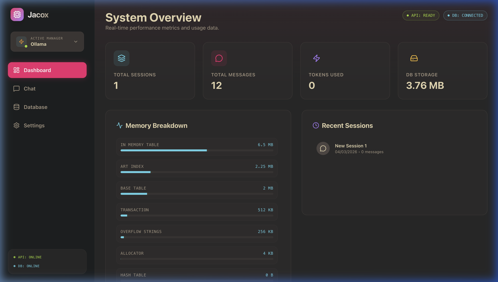

# 🌌 Stepbit: The High-Performance LLM Command Center

**Stepbit** is a premium, local-first LLM orchestration platform built with a **Rust** backbone and **DuckDB** intelligence. It’s designed for developers who demand speed, security, and a beautiful interface for their AI workflows.



---

## 🎨 A World-Class Aesthetic
Stepbit isn't just a server; it's a sleek, glassmorphic experience inspired by the **Monokai-Gruvbox** palette. 

- **Live CSS & HTML Rendering**: Inject active styles and raw HTML directly into chat for interactive demos.
- **Rich Markdown Rendering**: Full GFM support with optimized syntax highlighting.
- **High-Fidelity Charts**: Interactive **Line** and **Bar** charts with sub-micro granularity. [Learn more](FEATURES_GUIDE.md#8-high-fidelity-data-visualization-charts)
- **Live SVGs**: Dynamic graphic rendering directly in the chat.
- **Micro-animations**: A fluid, responsive interface with real-time **Thinking & Searching** status.
- **Process Cancellation**: Instantly stop any long-running generation or search.

---

## ⚡ Technical Excellence
- **Rust Core**: Blazing fast, memory-safe execution using Actix-web.
- **DuckDB Storage**: Analytical conversation memory in a single file (`chat.db`). [Learn more](FEATURES_GUIDE.md#2-local-memory-layer-duckdb)
- **Pluggable Intelligence**: Seamlessly switch between **OpenAI**, **Anthropic**, **Ollama**, **GitHub Copilot**, and the optional **LLMOS Cognitive Engine**.
- **Chained Request Security**: Rolling handshake protection for internal LLMOS communication, preventing replay attacks.
- **DuckDB Snapshotting**: Non-blocking analytical access to live data. [Learn more](FEATURES_GUIDE.md#12-live-data-analyst-snapshot-mode)
- **Reasoning Graph Engine**: A powerful DAG-based architecture with **Server-Sent Events (SSE)** for real-time node lifecycle tracking.
- **Cognitive Pipelines**: Structured, deterministic workflows with multi-stage reasoning, MCP integration, and **incremental result streaming**.
- **MCP Tool Registry**: Integrated Model Context Protocol support for tool discovery and schema management.
- **Real-Time Dashboard**: High-fidelity telemetry for tokens, messages, and storage.
- **Node 24 & React 19**: Modern frontend stack for maximum response times and security.

---

## 🚀 Quick Start: Cognitive Pipelines

Cognitive Pipelines are the core of Stepbit's automated reasoning. Here is how to get started in 3 steps:

1. **Enable LLMOS**: Ensure `stepbit-core` is running (optional but recommended for advanced pipelines).
2. **Import a Pipeline**: Go to the **Pipelines** tab and click **New Pipeline**. Paste a JSON definition.
3. **Execute**: Ask a question against the pipeline and watch the **Reasoning Trace** unfold in real-time.

> [!TIP]
> Try the **"Live Data self db analyst"** pipeline to see an AI analyze your chat history without interrupting your current sessions!

---

## 🏗️ Installation

### 1. Build the Engine
```bash
git clone https://github.com/jacovinus/stepbit.git
cd stepbit
cargo build --release
```

### 2. Configure Your Core
Edit `config.yaml` to unleash your preferred models:
```yaml
llm:
  provider: "ollama"  # or "openai", "anthropic", "copilot"
  model: "llama3.2"
```

### 3. Launch
```bash
cargo run -- serve
```

### 4. Access the Interface
- **AI Command Center**: `http://localhost:5173` (Primary Vite/React interface)

---

## 🛠 Advanced Features

### 🔌 Multi-Provider Management
Switch providers and models on the fly without restarting the server. The dynamic sidebar and chat header allow for instant context switching.

### 🧠 Cognitive Pipelines & Trace Viewer
Build and execute structured AI workflows with deterministic stages. Monitor every step of the reasoning process through the live **Trace Viewer**.

- **Multi-Stage Orchestration**: Combine LLM generation, MCP tool calls, and automated verification.
- **Deep Visibility**: See exactly how the AI arrived at an answer with granular trace logs.

### 📦 Lifecycle Management
- **Database Purge**: Clear all data instantly via `cargo run -- database purge` or API.
- **Export/Import**: Move your AI brain between environments via `.txt` files. [Learn more](FEATURES_GUIDE.md#5-session-portability-importexport)
- **Skills Library**: Reusable prompt snippets and persona templates. [Learn more](SKILLS.md)

---

## 📚 Documentation
- **[Features Guide](FEATURES_GUIDE.md)**: Deep-dive into capabilities and use cases.
- **[Changelog](CHANGELOG.md)**: Latest updates and version history.
- **[Project Journey](JOURNEY.md)**: Roadmap & vision board for the future.
- **[API Guide](API_GUIDE.md)**: Detailed REST & WebSocket endpoint documentation.

Built with 🦀 and 🎨 for those who care about the details.
