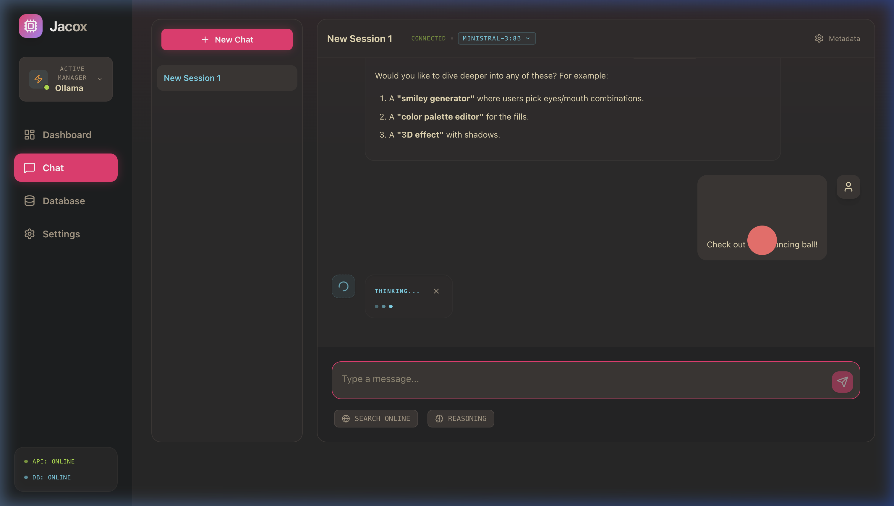
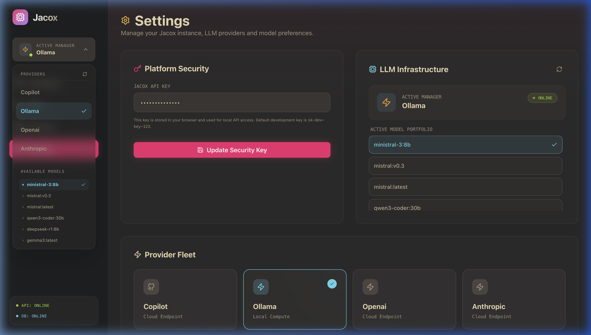
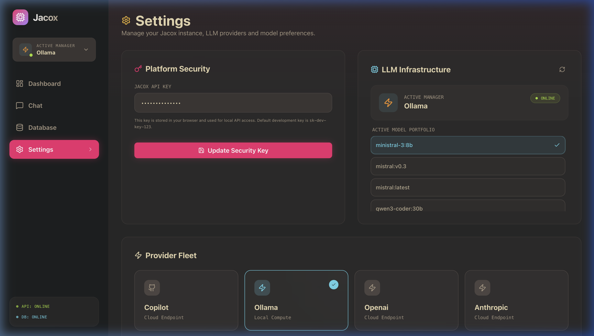

# 🌌 Jacox: The High-Performance LLM Command Center

**Jacox** is a premium, local-first LLM orchestration platform built with a **Rust** backbone and **DuckDB** intelligence. It’s designed for developers who demand speed, security, and a beautiful interface for their AI workflows.


---

## 🎨 A World-Class Aesthetic
Jacox isn't just a server; it's a sleek, dark-mode experience inspired by the **Monokai-Gruvbox** palette. 

- **Live CSS & HTML Rendering**: Inject active styles and raw HTML directly into chat for interactive demos.
- **Rich Markdown Rendering**: Full GFM support with optimized syntax highlighting.
- **High-Fidelity Charts**: Interactive **Line** and **Bar** charts with sub-micro granularity. [Learn more](FEATURES_GUIDE.md#8-high-fidelity-data-visualization-charts-)
- **Live SVGs**: Dynamic graphic rendering directly in the chat.
- **Micro-animations**: A fluid, responsive interface with real-time **Thinking & Searching** status.
- **Process Cancellation**: Instantly stop any long-running generation or search.



---

## ⚡ Technical Excellence
- **Rust Core**: Blazing fast, memory-safe execution using Actix-web.
- **DuckDB Storage**: Analytical conversation memory in a single file (`chat.db`). [Learn more](FEATURES_GUIDE.md#2-local-memory-layer-duckdb-)
- **Pluggable Intelligence**: Seamlessly switch between **OpenAI**, **Anthropic**, **Ollama**, and **GitHub Copilot**. 
- **Internet Search**: Built-in scraper tool for real-world data fetching. [Learn more](FEATURES_GUIDE.md#7-internet-search-tool-)
- **Real-Time Dashboard**: High-fidelity telemetry for tokens, messages, and storage.
- **Memory Profiling**: Detailed **DuckDB Memory Breakdown** with visual profiling.

---

## 🚀 Getting Started

### 1. Build the Engine
```bash
git clone https://github.com/jacovinus/jacox.git
cd jacox
cargo build --release
```

### 2. Configure Your Core
Edit `config.yaml` to unleash your preferred models:
```yaml
llm:
  provider: "ollama"  # or "openai", "anthropic", "copilot"
  model: "llama3.2"
```

### 3. Launch
```bash
cargo run -- serve
```

---

## 📊 Dashboard & Telemetry
The built-in dashboard provides a "God-view" of your AI infrastructure:
- **Token Estimation**: Monitor API costs with precise heuristics.
- **Memory Inspection**: Deep-dive into DuckDB memory allocation (Buffer Manager, Storage, etc.).
- **Health Telemetry**: Real-time status for your API and DuckDB kernels.


---

## 🛠 Advanced Features

### 🔌 Multi-Provider Management
Switch providers and models on the fly without restarting the server. The dynamic sidebar and chat header allow for instant context switching.



### 💻 Developer Settings & Security
Manage your Jacox API keys and monitor your provider fleet (OpenAI, Anthropic, Ollama, Copilot) from a centralized, real-time dashboard.



### 📦 Lifecycle Management
- **Database Purge**: Clear all data instantly via `cargo run -- database purge` or API. [See Changelog](CHANGELOG.md)
- **Export/Import**: Move your AI brain between environments via `.txt` files. [Learn more](FEATURES_GUIDE.md#5-session-portability-importexport-)
- **CLI REPL**: Integrated terminal interface for power users.

---

## 📚 Documentation
- **[Features Guide](FEATURES_GUIDE.md)**: Deep-dive into capabilities and use cases.
- **[Changelog](CHANGELOG.md)**: Latest updates and version history.
- **[API Documentation](static/index.html)**: Landing page and health status.

Built with 🦀 and 🍕 for those who care about the details.
